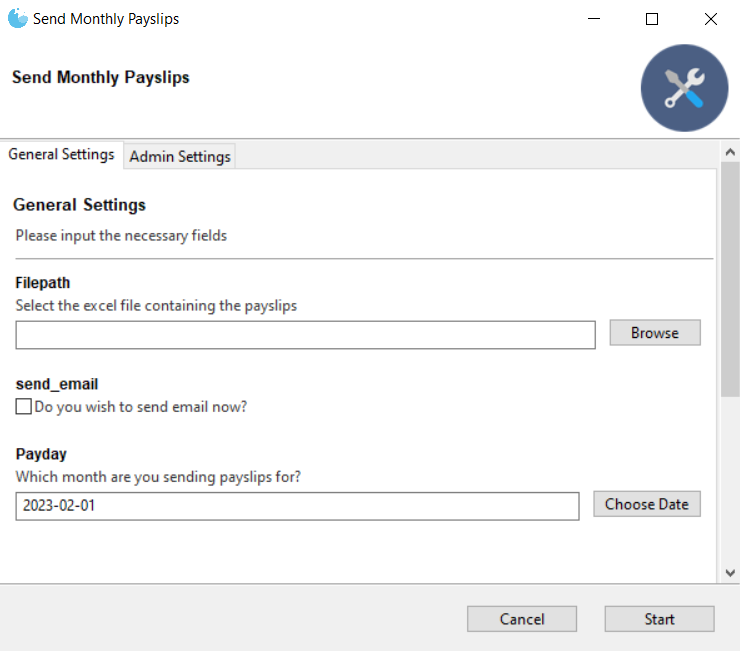
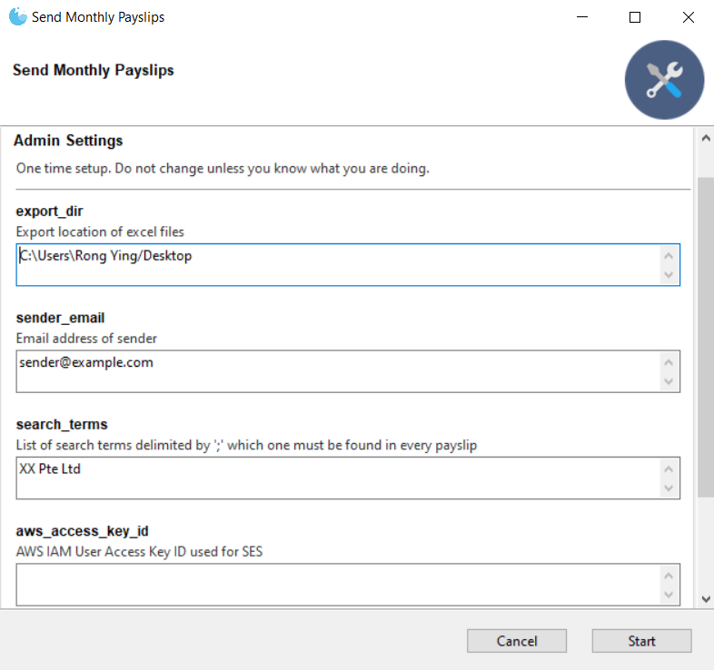

# Turtmail Service

1. Takes an excel input and saves each (half) sheet as a pdf
2. Sends out pdf as an email attachment using AWS Simple Email Service (SES)

Context: Sending out monthly payslips to employees
NEW: Use Gooey package to create user interface




## Setting up
- AWS Account and credentials for SES
- Python3 
- Windows environment
- Microsoft Excel

```bash
python -m venv venv
venv\Scripts\activate
(venv) pip install -r requirements.txt
```

## Infra set up
1. Creates a SES Config set
2. Creates a SNS Topic for failed delivery -> triggers email sent (email subscription done manually)
3. Creates a SNS Topic for successful delivery -> triggers lambda function that logs output to Cloudwatch
4. Create a lambda function to log successful and unsuccessful email delivery
5. Create an IAM user with permissions to send raw email

## Running program
1. Running on Windows: Create a batch script "Payslip.bat" with contents as per below. Run the batch file.
```commandline
"C:\Users\xxx\venv\Scripts\python.exe" "path/to/payslips-mailer-runner.py"
```
*TIP*: Use `where python` to get the path of python executable

2.  Running from command line
```bash
(venv) python payslip-mailer-runner.py
```

## Important to note:
- use AWS SES configuration set to monitor email delivery
- SES pricing: $0.10 for every 1,000 emails sent/mth
- SNS pricing: 1,000 email notifications/mth (free tier), no charges to lambda (1GB/mth free data transfer out of SNS)
- Lambda pricing: $0.20 per 1M requests/mth, $0.17 per 10,000 GB-seconds of compute time/mth